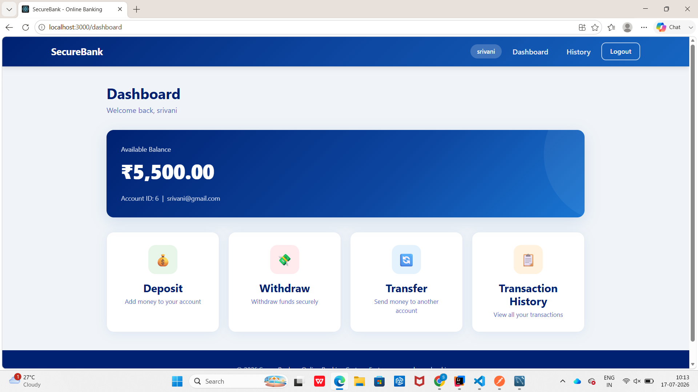
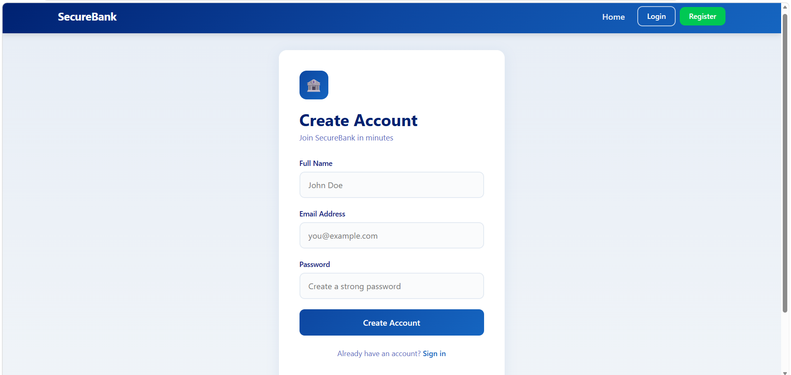
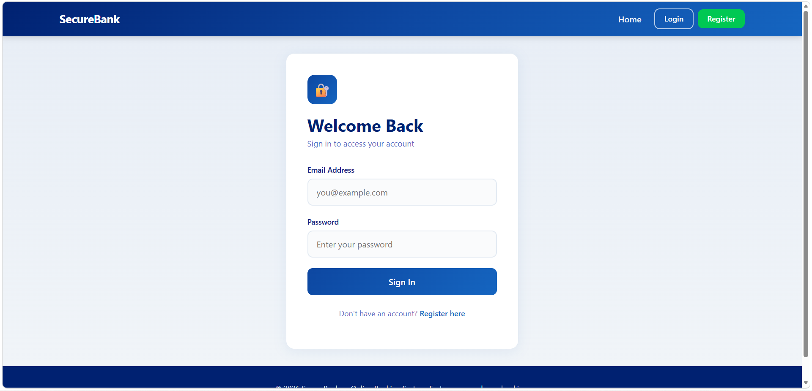
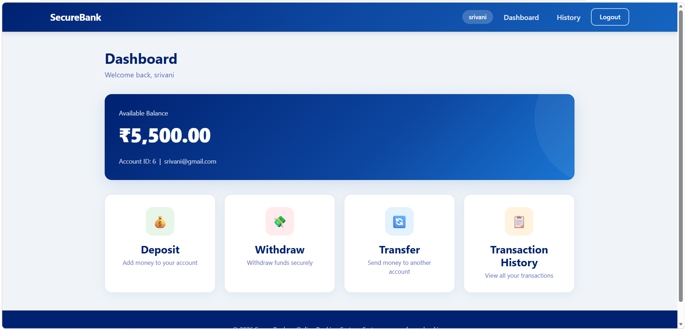
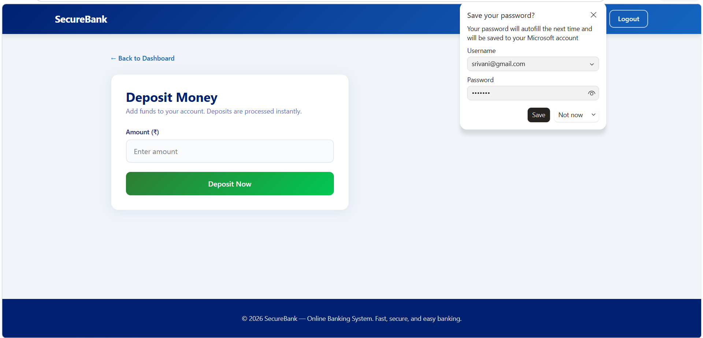
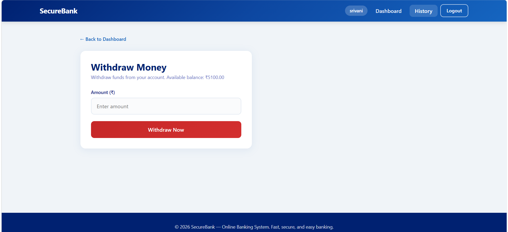
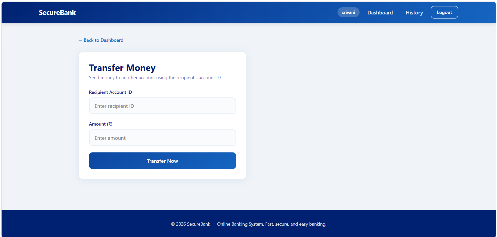

# 🏦 Online Banking System

<p align="center">
  
  
  
  
  
</p>

<p align="center">
A Full Stack Banking Application developed using <strong>Spring Boot, React.js, and MySQL</strong>. The system enables users to securely manage bank accounts, perform transactions, and monitor account activities through an intuitive web interface.
</p>

---

# 📖 Overview

The **Online Banking System** is a web-based application that simulates essential banking operations. Users can create accounts, log in, deposit funds, withdraw money, transfer money between accounts, update profile details, and view transaction history.

The project follows a **RESTful architecture**, with a React frontend communicating with a Spring Boot backend connected to a MySQL database.

---

# ✨ Features

### 👤 User Management
- User Registration
- Secure Login
- View Profile
- Update Profile
- Delete Account
- Search User by Email

### 💰 Banking Services
- Deposit Money
- Withdraw Money
- Transfer Money
- Check Account Balance

### 📊 Transaction Management
- Record Every Transaction
- View Transaction History
- Maintain Account Balance Automatically

### 🖥 Frontend
- Modern Responsive UI
- Dashboard
- Banking Forms
- React Router Navigation
- API Integration using Axios

---

# 🛠 Technology Stack

## Frontend

- React.js
- React Router DOM
- Axios
- CSS3
- HTML5

## Backend

- Java 25
- Spring Boot
- Spring MVC
- Spring Data JPA
- Spring Security
- Maven

## Database

- MySQL 8

## Tools

- IntelliJ IDEA
- VS Code
- Postman
- Git
- GitHub

---

# 📂 Project Structure

```
OnlineBankingSystem
│
├── backend
│   ├── controller
│   ├── entity
│   ├── repository
│   ├── service
│   ├── config
│   └── resources
│
├── frontend
│   ├── public
│   └── src
│       ├── api
│       ├── components
│       ├── context
│       ├── pages
│       ├── App.js
│       └── index.js
│
├── postman
├── README.md
└── .gitignore
```

---

# ⚙ Installation

## Clone Repository

```bash
git clone https://github.com/Shravani-36/OnlineBankingSystem.git

cd OnlineBankingSystem
```

---

# Backend Setup

Move into backend directory

```bash
cd backend
```

Configure **application.properties**

```properties
spring.datasource.url=jdbc:mysql://localhost:3306/online_banking
spring.datasource.username=root
spring.datasource.password=your_password

spring.jpa.hibernate.ddl-auto=update
spring.jpa.show-sql=true
```

Run the backend

```bash
mvn spring-boot:run
```

Backend runs on

```
http://localhost:8080
```

---

# Frontend Setup

Move into frontend directory

```bash
cd frontend
```

Install dependencies

```bash
npm install
```

Start React

```bash
npm start
```

Frontend runs on

```
http://localhost:3000
```

---

# REST API Endpoints

| Method | Endpoint | Description |
|----------|----------------------------|----------------------------|
| POST | /api/users/register | Register User |
| POST | /api/users/login | Login |
| GET | /api/users/{id} | Get User |
| GET | /api/users/email/{email} | Search User |
| PUT | /api/users/deposit/{id}/{amount} | Deposit Money |
| PUT | /api/users/withdraw/{id}/{amount} | Withdraw Money |
| PUT | /api/users/transfer/{from}/{to}/{amount} | Transfer Money |
| PUT | /api/users/update/{id} | Update User |
| DELETE | /api/users/delete/{id} | Delete User |
| GET | /api/transactions/{userId} | Transaction History |

---


# 🖼 Application Screenshots

> Replace these images with your screenshots after completing the project.

| Home Page |
|------------|
|  |

| Register | Login |
|-----------|-------|
|  |  |

| Dashboard |
|------------|
|  |

| Deposit | Withdraw |
|-----------|----------|
|  |  |

| Transfer |
|-----------|
|  |

| Transaction History |
|----------------------|
|  |

---

# 🏗 System Architecture

```
                React Frontend
                      │
          Axios HTTP Requests
                      │
             Spring Boot REST API
                      │
             Service Layer (Business Logic)
                      │
           Spring Data JPA Repository
                      │
                 MySQL Database
```

---

# 🚀 Future Enhancements

- JWT Authentication
- BCrypt Password Encryption
- Role Based Authentication
- Admin Dashboard
- Email Verification
- Forgot Password
- Account Statement PDF
- Charts & Analytics
- Notification System
- Mobile Responsive Design
- Docker Deployment
- Cloud Deployment (AWS/Azure)

---

# 🧪 Testing

Backend APIs were tested using:

- Postman
- Browser
- React Frontend

---

# 👩‍💻 Author

**Shravani Kola**

🎓 B.Tech Student

GitHub:
https://github.com/Shravani-36


# 📄 License

This project is developed for educational and learning purposes.
